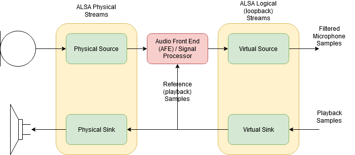
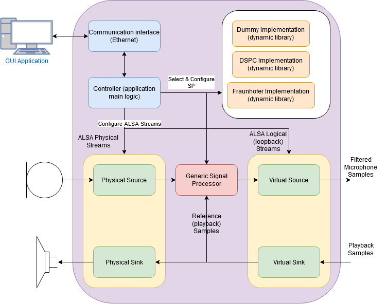
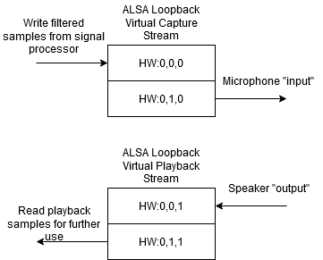

# Audio Front End (AFE) repository
Audio Front End (AFE) repository for solutions incorporating Voice Assistants like Alexa from Amaozn etc.

To be able to precisely detect human language, the gathered signal from microphone must be clean without 
any echo, noise and other disturbances.
To filter out noise, echo etc. a microphone array is used. Based on the number of microphones the input 
into the embedded device consists of several microphone (usually) interleaved signals. Such a compound 
signal should be fed into a signal processor (commonly known as Audio Front End), which filters out noise,
echo and other disturbances. The output from the signal processor is the desired single channel clear 
microphone audio, which is used for further processing (word detection and natural language utilization).

To interface the audio on Linux OS, the Advanced Linux Sound Architecture (ALSA) library is used. The 
signal processing is handled by a signal processor (AFE) provided by a proprietary library from a third
party vendor. The whole situation is depicted on following picture.

## The problem
As depicted on the audio chain picture, there are two main problems:
- AFE
- Audio Streams

From this perspective it's not possible to replace one vendor with another, as this would need to rewrite
the code and reconfigure the audio streams with every new AFE vendor.

# The NXP AFE architecture
To overcome the issues with different AFE vendors and reconfiguration of audio streams we defined an
NXP AFE. From this perspective, the NXP AFE is not just a signal processor, rather it's a complex
controller allowing to load signal processors from different vendors and based on provided settings
configure all the necessary streams to make the whole audio chain functional. Further it would allow
to communicate over ethernet to change the audio chain configuration on fly. The architecture is depicted
on the following picture.

## Generic signal processor
To allow the change between signal processors a generic Signal Processor API has been defined - pure 
virtual base class (named SignaProcessorImplementation). The purpose of this class is only to define 
the interface for the Signal Processor and it's capabilities.

The third party libraries can be wrapped into a new class derived from SignalProcessorImplementation base
class and compiled into a dynamic library. The library can be afterwards dynamically loaded/unloaded,
which overcomes all the issues:
- we can interchange the AFE from different vendors without the need of rewriting the source code
- we can switch the AFE on fly (if necessary), no need to stop/start the application

### Signal processor source code
The src/SignalProcessor/SignalProcessorImplementation.h header defines the base class. An example of how to use
this interface is demonstrated on a dummy signal processor implementation found under src/SignalProcessor_Dummy.cpp/h.

One of the most important part of the base class is, that the derived class must report it's options and possible
configurations using a JSON format as a string. This can be used either for some automated configuration or
with conjunction with a GUI based app. This GUI based app would allow the user in a friendly manner configure
the signal processor.

## Audio stream wrappers
The ALSA library represents an interface between the HW and the SW and can be used to read/write samples
from/to streams.

### Audio stream source code
To ease the use of ALSA, a simple class hierarchy for audio streams has been defined and is
located under src/AudioStream/.

### Audio chain using ALSA
Before we can provide clean microphone signal to the audio assistant, we need to filter out the microphone signals
with the use of playback (reference signal). This has following consequences:
- we need to read captured samples
- we need to modify the chain in a way, that we can read out playback samples before they are being played
- we need to write the filtered microphone signal somewhere so the applications can have access to it

ALSA provides a solution to the above points using ALSA loopback virtual device(s). This device allows to
read back written values. So we configure the chain in a way, that all applications playing audio will write 
into this device so we can read the playback samples for further use. For the capture stream, we need to define
the devices in such a way, that the applications will read out from this loopback device while we will write
the filtered samples into this device. Picture below provides a more detailed insight into the loopback
configuration.

We need to define our own ALSA configuration to support the abovementioned approach. This can be found under misc/
in "asound.conf" file. Specific configurations can be stored either under /etc/asound.conf or under $HOME/.asoundrc.

# Project status
The src/main.cpp represents an example how to use the audio stream class in conjunction with the signal processor
classes to load an implementation and filter the signals.

The full impmlementation of the NXP AFE has not been finished and was put on hold at the moment.

# How to compile the example
Cd to <project_folder> and exacute "make".

This would create a build directory with binary in under build/bin/.

# How to compile the dummy signal processor
Cd to <project_folder>/src/SignalProcessor and execute "make".

This would create a build directory with the library under /build/bin.